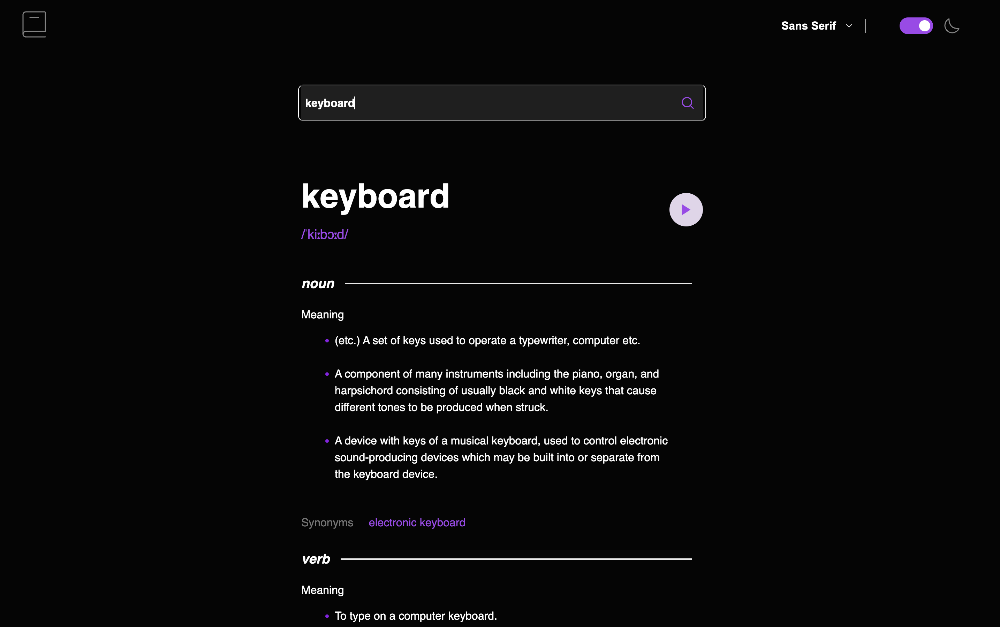
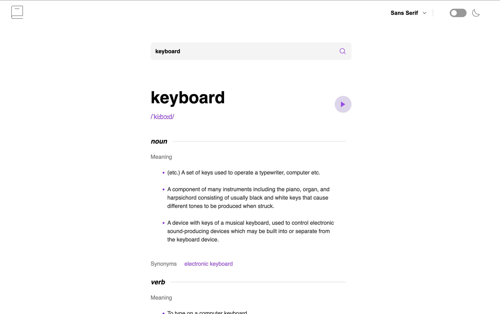
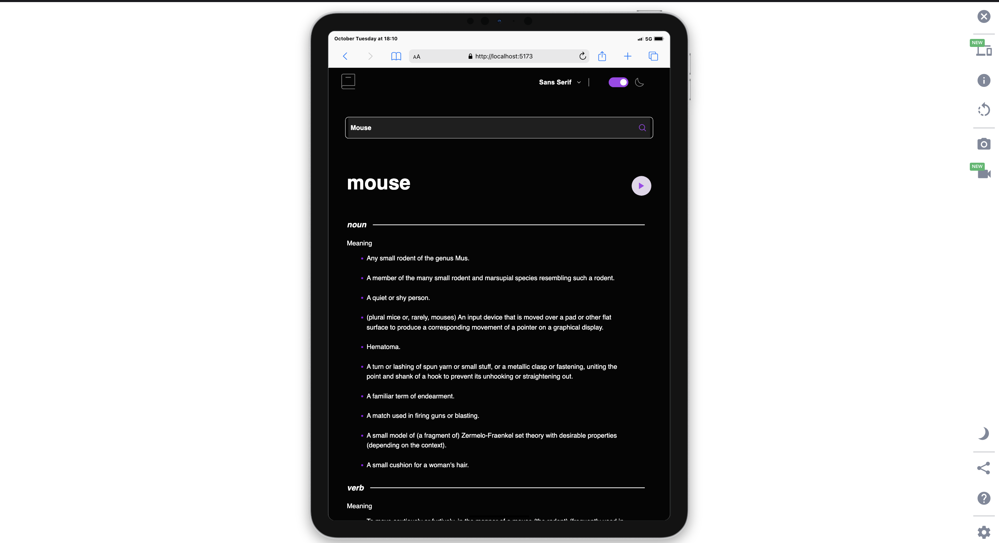
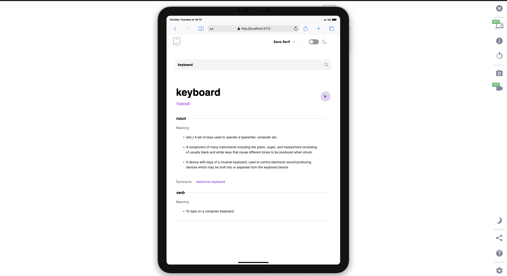
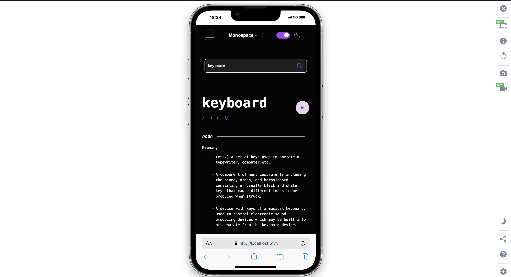
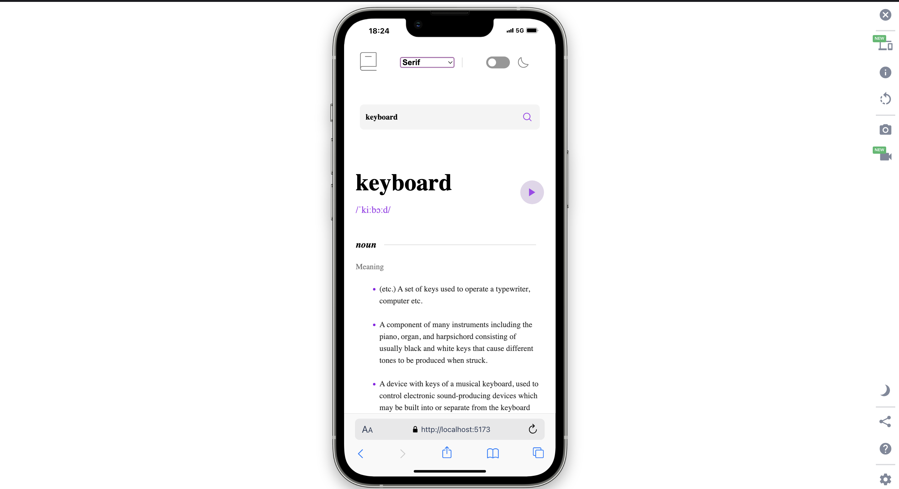

# Frontend Mentor - Dictionary web app solution

This is a solution to the [Dictionary web app challenge on Frontend Mentor](https://www.frontendmentor.io/challenges/dictionary-web-app-h5wwnyuKFL). Frontend Mentor challenges help you improve your coding skills by building realistic projects. 

## Table of contents

- [Frontend Mentor - Dictionary web app solution](#frontend-mentor---dictionary-web-app-solution)
  - [Table of contents](#table-of-contents)
  - [Overview](#overview)
    - [The challenge](#the-challenge)
    - [Screenshot](#screenshot)
    - [Links](#links)
  - [My process](#my-process)
    - [Built with](#built-with)
  - [Author](#author)
  - [Acknowledgments](#acknowledgments)

## Overview

### The challenge

Users should be able to:

- Search for words using the input field
- See the Free Dictionary API's response for the searched word
- See an alert message when trying to submit a blank form
- Play the audio file for a word when it's available
- Switch between serif, sans serif, and monospace fonts
- Switch between light and dark themes

### Screenshot

### Links

- Solution URL: [Github](https://github.com/Aayush895/Frontend-Dictionary-App)
- Live Site URL: [Live link](https://frontend-dictionary-app.vercel.app/)

## My process

### Built with

- React
- Module Css

## Author

- Frontend Mentor - [@Aayush895](https://www.frontendmentor.io/profile/Aayush895)

## Acknowledgments

I would like to thank the entire Frontend Mentor team for providing such interesting challenges to test and improve my skills in frontend web development.

